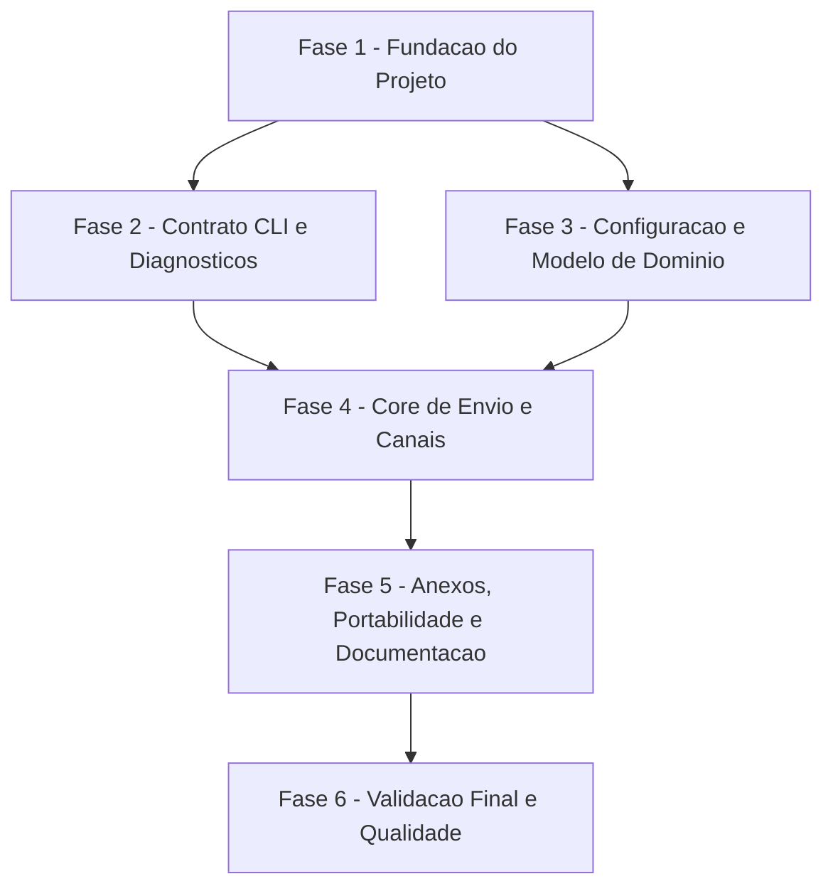

# Tarefas NotiCLI - CLI Notifications MVP

Escopo: implementar o MVP da CLI nao interativa para envio de notificacoes por email, Telegram e Slack, com configuracao JSON, anexos, diagnosticos seguros e contratos de exit code.

**Legenda de status:**
- `[ ]` Pendente
- `[~]` Em andamento
- `[x]` Concluido
- `[!]` Bloqueado

**Legenda de criticidade:**
- `[C]` Critico - Impacto financeiro direto, regulatorio, seguranca, SLA ou operacao bloqueante
- `[A]` Alto - Funcionalidade essencial
- `[M]` Medio - Necessario, mas sem urgencia imediata

---

## FASE 1 - Fundacao do Projeto

### 1.1 Confirmar Escopo do MVP CLI `[M]`

Ref: checklists/requirements.md CHK022; research.md Decision 6

- [x] 1.1.1 Registrar que modo servico/API local permanece fora do MVP. <!-- validado em research.md Decision 6 e plan.md Technical Context -->
- [x] 1.1.2 Confirmar que o design deve apenas preservar reutilizacao futura do core. <!-- validado em plan.md Summary e Structure Decision -->
- [x] 1.1.3 Atualizar documentacao se a decisao de escopo mudar. <!-- sem mudanca de escopo; CHK022 resolvido em checklists/requirements.md -->

### 1.2 Inicializar Projeto Go `[A]`

Ref: plan.md Project Structure; constitution.md Portable Core

- [x] 1.2.1 Criar `go.mod` com versao Go alvo. <!-- go.mod criado com go 1.26 -->
- [x] 1.2.2 Criar estrutura `cmd/noticli` e `internal/`. <!-- criado cmd/noticli/main.go e diretorios internal com pacotes reais na tarefa 1.3 -->
- [x] 1.2.3 Criar `README.md` inicial com objetivo do projeto.
- [x] 1.2.4 Validar `go test ./...` em projeto vazio/minimo. <!-- go1.26.4: ? github.com/rodrigogml/NotiCLI/cmd/noticli [no test files] -->

### 1.3 Definir Esqueleto de Pacotes Internos `[A]`

Ref: plan.md Project Structure

- [x] 1.3.1 Criar pacotes internos para app, notify, config e diagnostics. <!-- criado internal/app, internal/notify, internal/config e internal/diagnostics -->
- [x] 1.3.2 Criar pacotes internos para canais email, telegram e slack. <!-- criado internal/channels/email, slack e telegram -->
- [x] 1.3.3 Definir interfaces minimas entre core e canais. <!-- notify.ChannelSender definido -->
- [x] 1.3.4 Adicionar testes de compilacao ou smoke para estrutura inicial. <!-- go1.26.4: go test ./... passou; internal/notify ok -->

---

## FASE 2 - Contrato CLI e Diagnosticos

### 2.1 Implementar Entrada CLI `send` `[A]`

Ref: contracts/cli.md Command `noticli send`; spec.md FR-001..FR-003

- [x] 2.1.1 Implementar parsing de `send` com flags obrigatorias e opcionais. <!-- implementado em internal/cli.Parse; inclui --sender obrigatorio -->
- [x] 2.1.2 Validar ausencia de prompts ou leitura interativa. <!-- binario: exit=2 stdout vazio stderr invalid_input para input invalido -->
- [x] 2.1.3 Mapear flags para Notification Request. <!-- teste TestParseSendMapsFlagsToNotificationRequest -->
- [x] 2.1.4 Cobrir parsing e validacao basica com testes. <!-- go1.26.4: internal/cli ok -->

### 2.2 Implementar Exit Codes e Categorias de Erro `[C]`

Ref: contracts/cli.md Result Semantics; spec.md FR-007..FR-011

- [x] 2.2.1 Definir constantes para categorias e exit codes. <!-- implementado em internal/diagnostics -->
- [x] 2.2.2 Mapear erros conhecidos para categorias estaveis. <!-- diagnostics.FromError preserva Diagnostic e fallback para internal_error -->
- [x] 2.2.3 Garantir exatamente um resultado final por invocacao. <!-- cli.Run usa diagnostics.WriteFailure para um unico output final de erro -->
- [x] 2.2.4 Testar mapeamento de cada categoria documentada. <!-- go1.26.4: internal/diagnostics ok; binario validou exit 2 e exit 1 -->

### 2.3 Implementar Diagnosticos Seguros `[C]`

Ref: constitution.md Secure Configuration and Secret Handling; spec.md FR-010

- [x] 2.3.1 Implementar redacao de tokens, senhas e webhook URLs. <!-- implementado em diagnostics.Redactor -->
- [x] 2.3.2 Padronizar saida de erro em linha unica por padrao. <!-- diagnostics.WriteFailure normaliza whitespace -->
- [x] 2.3.3 Incluir canal afetado em falhas de canal. <!-- diagnostics.ForChannel testado -->
- [x] 2.3.4 Testar que segredos nao aparecem em mensagens de erro. <!-- TestWriteFailureRedactsSensitiveValues -->

---

## FASE 3 - Configuracao e Modelo de Dominio

### 3.1 Implementar Modelo de Dados do Core `[A]`

Ref: data-model.md; spec.md Key Entities

- [x] 3.1.1 Definir Notification Request, Recipient, Channel Configuration, Attachment e Delivery Result. <!-- implementado em internal/notify; inclui SenderSystem e Configuration para recipients e channels globais -->
- [x] 3.1.2 Definir validacoes de campos obrigatorios. <!-- Validate em Request, Configuration, Recipient, ChannelConfig e Attachment -->
- [x] 3.1.3 Definir estados/categorias necessarios para resultados. <!-- DeliveryState, ResultCategory, SuccessResult e FailureResult -->
- [x] 3.1.4 Testar validacoes do modelo de dominio. <!-- go1.26.4: internal/notify ok -->

### 3.2 Implementar Leitura de Configuracao JSON `[A]`

Ref: research.md Decision 2; contracts/cli.md Configuration Contract; spec.md FR-004..FR-005

- [x] 3.2.1 Definir estrutura JSON de recipients, channels e defaults. <!-- implementado em internal/config File structs -->
- [x] 3.2.2 Implementar leitura por `--config` e caminho default documentado. <!-- config.Load integrado ao cli.Run; parser preserva default no diretorio do executavel -->
- [x] 3.2.3 Tratar arquivo ausente, ilegivel e JSON malformado. <!-- Load mapeia missing_config e invalid_config -->
- [x] 3.2.4 Testar leitura de configuracao valida e erros de arquivo/formato. <!-- go1.26.4: internal/config e internal/cli ok -->

### 3.3 Implementar Validacao de Configuracao `[C]`

Ref: spec.md FR-005, FR-010; contracts/cli.md Secret Handling Requirements

- [x] 3.3.1 Validar recipients habilitados e destinos por canal. <!-- notify.Configuration.Resolve valida recipient enabled e DestinationFor(channel) -->
- [x] 3.3.2 Validar channels habilitados, settings e secrets obrigatorios. <!-- ChannelConfig.ValidateForDelivery valida enabled, settings/secrets nao vazios e chaves secretas minimas por canal -->
- [x] 3.3.3 Marcar campos secretos para redacao em diagnosticos. <!-- Configuration.SecretValues coleta secrets e cli.Run usa diagnostics.NewRedactor -->
- [x] 3.3.4 Testar configuracao incompleta sem vazamento de segredos. <!-- go1.26.4: internal/cli TestRunReturnsInvalidConfigWithoutLeakingSecrets; internal/notify Resolve tests -->

---

## FASE 4 - Core de Envio e Canais

### 4.1 Implementar Orquestrador de Notificacao `[A]`

Ref: plan.md Structure Decision; spec.md FR-017, FR-020

- [x] 4.1.1 Criar fluxo de validacao antes de dispatch. <!-- App.Notify usa Configuration.Resolve antes do sender; go1.26.0: internal/app ok -->
- [x] 4.1.2 Resolver recipient e channel a partir da configuracao. <!-- App.Notify passa resolved.Recipient e resolved.Channel ao sender fake nos testes -->
- [x] 4.1.3 Invocar adaptador de canal por interface. <!-- App registra notify.ChannelSender por Name e CLI injeta email/telegram/slack -->
- [x] 4.1.4 Testar fluxo com adaptador fake para sucesso e falha. <!-- go1.26.0: TestNotifyValidatesAndDispatchesResolvedRequest, TestNotifyReturnsSenderFailure -->

### 4.2 Implementar Canal Email `[A]`

Ref: spec.md User Story 3; contracts/cli.md Channel Fields

- [x] 4.2.1 Implementar validacao de settings e secrets do email. <!-- email.Sender valida settings host/port/from e secret smtp_password; go1.26.0: internal/channels/email ok -->
- [x] 4.2.2 Implementar envio de titulo, conteudo e destinatario por email. <!-- SMTPTransport envia assunto/corpo para recipient.Email com From configurado -->
- [x] 4.2.3 Mapear falhas do provedor para delivery_failure. <!-- TestSendMapsTransportFailureToDeliveryFailure -->
- [x] 4.2.4 Testar email com transporte fake ou servidor de teste local. <!-- go1.26.0: TestSendBuildsMessageAndUsesTransport -->

### 4.3 Implementar Canal Telegram `[A]`

Ref: spec.md User Story 3; contracts/cli.md Channel Fields

- [x] 4.3.1 Implementar validacao de token e destino Telegram. <!-- telegram.Sender valida secret token e recipient.TelegramChatID; go1.26.0: internal/channels/telegram ok -->
- [x] 4.3.2 Implementar envio de mensagem ao destino configurado. <!-- sendMessage POSTa chat_id/text em /bot{token}/sendMessage -->
- [x] 4.3.3 Mapear rejeicoes/timeouts para delivery_failure. <!-- TestSendMapsProviderHTTPFailureToDeliveryFailureWithoutLeakingToken e TestSendMapsClientFailureToDeliveryFailureWithoutLeakingToken -->
- [x] 4.3.4 Testar Telegram com cliente HTTP fake. <!-- go1.26.0: TestSendPostsMessageToTelegramAPI -->

### 4.4 Implementar Canal Slack `[A]`

Ref: spec.md User Story 3; contracts/cli.md Channel Fields

- [x] 4.4.1 Implementar validacao de credenciais/destino Slack. <!-- slack.Sender valida secret webhook_url e recipient.SlackDest; go1.26.0: internal/channels/slack ok -->
- [x] 4.4.2 Implementar envio de mensagem ao destino configurado. <!-- sendWebhook POSTa JSON com text/channel no webhook configurado -->
- [x] 4.4.3 Mapear rejeicoes/timeouts para delivery_failure. <!-- TestSendMapsProviderHTTPFailureToDeliveryFailureWithoutLeakingWebhook e TestSendMapsClientFailureToDeliveryFailureWithoutLeakingWebhook -->
- [x] 4.4.4 Testar Slack com cliente HTTP fake. <!-- go1.26.0: TestSendPostsMessageToSlackWebhook -->

---

## FASE 5 - Anexos, Portabilidade e Documentacao

### 5.1 Implementar Validacao de Anexos `[A]`

Ref: spec.md User Story 4; spec.md FR-013..FR-014

- [x] 5.1.1 Aceitar multiplos `--attach`. <!-- parser ja acumulava attachmentFlags; validado em TestParseSendMapsFlagsToNotificationRequest -->
- [x] 5.1.2 Validar existencia, leitura e tipo arquivo antes de dispatch. <!-- App.Notify chama notify.ValidateAttachments antes do sender; go1.26.0: internal/app e internal/notify ok -->
- [x] 5.1.3 Aplicar politica de suporte por canal. <!-- ValidateAttachments retorna attachment_error quando AttachmentPolicyUnsupported recebe anexos -->
- [x] 5.1.4 Testar arquivo ausente, diretorio, arquivo ilegivel e multiplos anexos. <!-- TestValidateAttachmentsRejectsMissingFileAndDirectory, TestValidateAttachmentsRejectsUnreadableFile, TestValidateAttachmentsEnrichesMultipleReadableFiles -->

### 5.2 Implementar Comportamento de Anexos por Canal `[M]`

Ref: contracts/cli.md Arguments; quickstart.md Scenario 7

- [x] 5.2.1 Documentar suporte inicial de anexos por email, Telegram e Slack. <!-- contracts/cli.md Attachment Behavior documenta email suportado e telegram/slack attachment_error -->
- [x] 5.2.2 Implementar envio de anexos nos canais suportados. <!-- email.SMTPTransport monta multipart/mixed com anexos base64 -->
- [x] 5.2.3 Retornar attachment_error para anexos nao suportados. <!-- Telegram e Slack retornam attachment_error quando request.Attachments nao vazio -->
- [x] 5.2.4 Testar sucesso e falha de anexos por canal. <!-- TestSendIncludesAttachmentsInTransportMessage, TestFormatSMTPMessageIncludesAttachmentPart, TestSendReturnsAttachmentErrorWhenAttachmentsAreRequested -->

### 5.3 Garantir Portabilidade Linux/Windows `[M]`

Ref: constitution.md Portable Core; spec.md FR-018

- [x] 5.3.1 Usar manipulacao de paths compativel com SO. <!-- config/defaults e attachments usam filepath/os APIs; go1.26.0: go test ./... -->
- [x] 5.3.2 Evitar separadores ou paths hardcoded. <!-- testes ajustados para filepath.Join em paths simulados -->
- [x] 5.3.3 Adicionar testes para paths relativos e absolutos. <!-- TestValidateAttachmentsAcceptsRelativeAndAbsolutePaths -->
- [x] 5.3.4 Documentar expectativa de build portable para Windows. <!-- README Portable Builds; GOOS=windows GOARCH=amd64 go build passou -->

### 5.4 Escrever Documentacao de Uso e Configuracao `[A]`

Ref: spec.md FR-015..FR-016; quickstart.md

- [x] 5.4.1 Documentar comandos de envio e flags. <!-- README Usage e Flags -->
- [x] 5.4.2 Documentar exemplo JSON sem segredos reais. <!-- README Configuration usa example.invalid e placeholders -->
- [x] 5.4.3 Documentar exit codes e categorias de erro. <!-- README Exit Codes -->
- [x] 5.4.4 Documentar setup de email, Telegram e Slack. <!-- README Channel Setup; quickstart referencia README -->

---

## FASE 6 - Validacao Final e Qualidade

### 6.1 Criar Suite de Testes Integrados da CLI `[A]`

Ref: quickstart.md; spec.md Success Criteria

- [x] 6.1.1 Testar happy path por canal com doubles/fakes. <!-- TestRunWithSendersHappyPathByChannel -->
- [x] 6.1.2 Testar input invalido e configuracao ausente/invalida. <!-- TestRunWithSendersReturnsExpectedExitCodesForFailureScenarios -->
- [x] 6.1.3 Testar falha de anexo e falha de entrega. <!-- TestRunWithSendersReturnsExpectedExitCodesForFailureScenarios cobre attachment_error e delivery_failure -->
- [x] 6.1.4 Testar que cada cenario retorna exit code esperado. <!-- go1.26.0: internal/cli ok; go test ./... passou -->

### 6.2 Validar Seguranca e Observabilidade `[C]`

Ref: spec.md SC-004; constitution.md Secure Configuration and Secret Handling

- [x] 6.2.1 Criar testes de redacao para segredos em erros simulados. <!-- TestRedactorRedactsConfiguredSecretValuesAndKnownProviderPatterns -->
- [x] 6.2.2 Validar diagnosticos de canal sem expor credenciais. <!-- TestRunWithSendersRedactsConfiguredSecretsFromChannelDiagnostics -->
- [x] 6.2.3 Revisar logs/saida padrao para evitar conteudo sensivel. <!-- falhas validam stdout vazio e stderr redigido nos testes de CLI -->
- [x] 6.2.4 Registrar limites de diagnostico seguro no README. <!-- README Safe Diagnostics -->

### 6.3 Validar Performance Basica e Build `[M]`

Ref: spec.md SC-007; plan.md Technical Context

- [x] 6.3.1 Medir validacao local sem provedor externo abaixo de 1 segundo. <!-- /tmp/noticli-6.3 send sem config: code=3 elapsed_ms=3 stdout vazio -->
- [x] 6.3.2 Executar `go test ./...`. <!-- go1.26.0: go test ./... passou -->
- [x] 6.3.3 Gerar build local do binario. <!-- go1.26.0: go build -o /tmp/noticli-6.3 ./cmd/noticli passou; go build ./... passou -->
- [x] 6.3.4 Verificar execucao sem argumentos com falha controlada e nao interativa. <!-- /tmp/noticli-6.3: code=2 stdout vazio stderr invalid_input: missing command -->

### 6.4 Revisar Conformidade SDD `[M]`

Ref: docs/specs/cli-notifications/*

- [x] 6.4.1 Confirmar que tarefas implementadas cobrem FR-001 a FR-020. <!-- rg FR + revisao Fases 2-6: CLI/config/canais/anexos/docs/testes cobrem FR-001..FR-020 -->
- [x] 6.4.2 Confirmar que quickstart reflete comportamento implementado. <!-- quickstart cenarios 1-9 conferidos contra RunWithSenders, ValidateAttachments e README -->
- [x] 6.4.3 Atualizar contratos se a implementacao exigir ajuste aprovado. <!-- contracts/cli.md e data-model.md alinhados: id/type inferidos por chave e attachments default unsupported -->
- [x] 6.4.4 Marcar tarefas concluidas com evidencia curta conforme execucao. <!-- tarefas 6.4 marcadas apos revisao SDD -->

---

## Matriz de Dependencias

## Resumo Quantitativo

| Fase | Tarefas | Subtarefas | Criticidade |
|------|---------|------------|-------------|
| 1 - Fundacao do Projeto | 3 | 11 | A/M |
| 2 - Contrato CLI e Diagnosticos | 3 | 12 | C/A |
| 3 - Configuracao e Modelo de Dominio | 3 | 12 | C/A |
| 4 - Core de Envio e Canais | 4 | 16 | A |
| 5 - Anexos, Portabilidade e Documentacao | 4 | 16 | A/M |
| 6 - Validacao Final e Qualidade | 4 | 16 | C/A/M |
| **Total** | **21** | **83** | - |

## Escopo Coberto

| Item | Descricao | Fase |
|------|-----------|------|
| CLI | Comando `send`, flags, validacao e nao interatividade | 2 |
| Configuracao | JSON local com recipients, channels, settings e secrets | 3 |
| Diagnosticos | Exit codes, categorias e redacao de segredos | 2, 6 |
| Core | Orquestracao reutilizavel para futuro servico local | 4 |
| Canais | Email, Telegram e Slack | 4 |
| Anexos | Validacao e politica por canal | 5 |
| Portabilidade | Linux MVP e compatibilidade futura com Windows | 5 |
| Documentacao | README, exemplos, config e quickstart | 5, 6 |
| Qualidade | Testes unitarios, integrados, seguranca e performance basica | 6 |

## Escopo Excluido

| Item | Descricao | Motivo |
|------|-----------|--------|
| Service Mode | Comando `serve` e API local | Futuro previsto, fora do runtime MVP |
| Agendamento/Fila | Retry assincrono, filas, scheduling e persistencia de jobs | Feature stateless por invocacao direta |
| Interface Interativa | Prompts, menus e confirmacoes | Viola o contrato nao interativo do projeto |
| Banco de Dados | Persistencia em banco relacional ou chave/valor | Configuracao local em arquivo cobre o MVP |
| Infra Paga | Servicos pagos obrigatorios | Restricao de custo zero |
