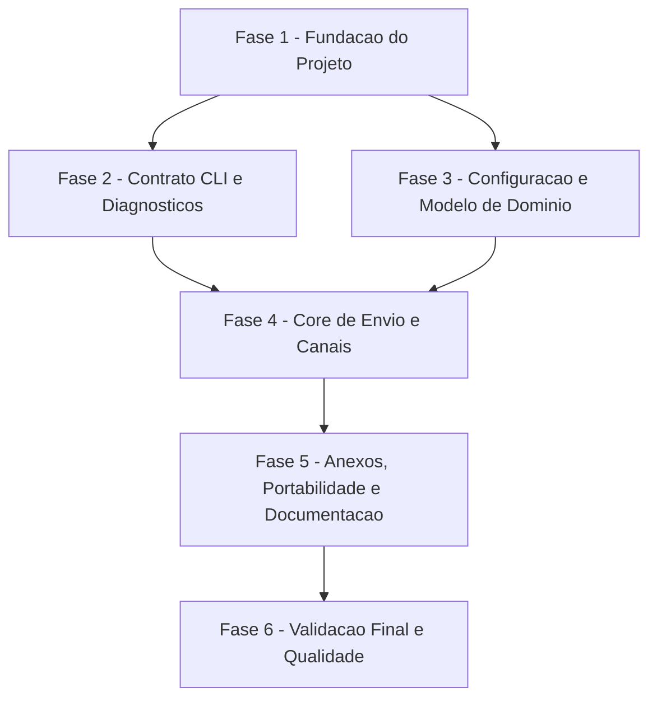

# Tarefas NotiCLI - CLI Notifications MVP

Escopo: implementar o MVP da CLI nao interativa para envio de notificacoes por email, Telegram e Slack, com configuracao JSON, anexos, diagnosticos seguros e contratos de exit code.

**Legenda de status:**
- `[ ]` Pendente
- `[~]` Em andamento
- `[x]` Concluido
- `[!]` Bloqueado

**Legenda de criticidade:**
- `[C]` Critico - Impacto financeiro direto, regulatorio, seguranca, SLA ou operacao bloqueante
- `[A]` Alto - Funcionalidade essencial
- `[M]` Medio - Necessario, mas sem urgencia imediata

---

## FASE 1 - Fundacao do Projeto

### 1.1 Confirmar Escopo do MVP CLI `[M]`

Ref: checklists/requirements.md CHK022; research.md Decision 6

- [x] 1.1.1 Registrar que modo servico/API local permanece fora do MVP. <!-- validado em research.md Decision 6 e plan.md Technical Context -->
- [x] 1.1.2 Confirmar que o design deve apenas preservar reutilizacao futura do core. <!-- validado em plan.md Summary e Structure Decision -->
- [x] 1.1.3 Atualizar documentacao se a decisao de escopo mudar. <!-- sem mudanca de escopo; CHK022 resolvido em checklists/requirements.md -->

### 1.2 Inicializar Projeto Go `[A]`

Ref: plan.md Project Structure; constitution.md Portable Core

- [x] 1.2.1 Criar `go.mod` com versao Go alvo. <!-- go.mod criado com go 1.26 -->
- [x] 1.2.2 Criar estrutura `cmd/noticli` e `internal/`. <!-- criado cmd/noticli/main.go e diretorios internal com pacotes reais na tarefa 1.3 -->
- [x] 1.2.3 Criar `README.md` inicial com objetivo do projeto.
- [x] 1.2.4 Validar `go test ./...` em projeto vazio/minimo. <!-- go1.26.4: ? github.com/rodrigogml/NotiCLI/cmd/noticli [no test files] -->

### 1.3 Definir Esqueleto de Pacotes Internos `[A]`

Ref: plan.md Project Structure

- [x] 1.3.1 Criar pacotes internos para app, notify, config e diagnostics. <!-- criado internal/app, internal/notify, internal/config e internal/diagnostics -->
- [x] 1.3.2 Criar pacotes internos para canais email, telegram e slack. <!-- criado internal/channels/email, slack e telegram -->
- [x] 1.3.3 Definir interfaces minimas entre core e canais. <!-- notify.ChannelSender definido -->
- [x] 1.3.4 Adicionar testes de compilacao ou smoke para estrutura inicial. <!-- go1.26.4: go test ./... passou; internal/notify ok -->

---

## FASE 2 - Contrato CLI e Diagnosticos

### 2.1 Implementar Entrada CLI `send` `[A]`

Ref: contracts/cli.md Command `noticli send`; spec.md FR-001..FR-003

- [x] 2.1.1 Implementar parsing de `send` com flags obrigatorias e opcionais. <!-- implementado em internal/cli.Parse -->
- [x] 2.1.2 Validar ausencia de prompts ou leitura interativa. <!-- binario: exit=2 stdout vazio stderr invalid_input para input invalido -->
- [x] 2.1.3 Mapear flags para Notification Request. <!-- teste TestParseSendMapsFlagsToNotificationRequest -->
- [x] 2.1.4 Cobrir parsing e validacao basica com testes. <!-- go1.26.4: internal/cli ok -->

### 2.2 Implementar Exit Codes e Categorias de Erro `[C]`

Ref: contracts/cli.md Result Semantics; spec.md FR-007..FR-011

- [ ] 2.2.1 Definir constantes para categorias e exit codes.
- [ ] 2.2.2 Mapear erros conhecidos para categorias estaveis.
- [ ] 2.2.3 Garantir exatamente um resultado final por invocacao.
- [ ] 2.2.4 Testar mapeamento de cada categoria documentada.

### 2.3 Implementar Diagnosticos Seguros `[C]`

Ref: constitution.md Secure Configuration and Secret Handling; spec.md FR-010

- [ ] 2.3.1 Implementar redacao de tokens, senhas e webhook URLs.
- [ ] 2.3.2 Padronizar saida de erro em linha unica por padrao.
- [ ] 2.3.3 Incluir canal afetado em falhas de canal.
- [ ] 2.3.4 Testar que segredos nao aparecem em mensagens de erro.

---

## FASE 3 - Configuracao e Modelo de Dominio

### 3.1 Implementar Modelo de Dados do Core `[A]`

Ref: data-model.md; spec.md Key Entities

- [ ] 3.1.1 Definir Notification Request, Recipient, Channel Configuration, Attachment e Delivery Result.
- [ ] 3.1.2 Definir validacoes de campos obrigatorios.
- [ ] 3.1.3 Definir estados/categorias necessarios para resultados.
- [ ] 3.1.4 Testar validacoes do modelo de dominio.

### 3.2 Implementar Leitura de Configuracao JSON `[A]`

Ref: research.md Decision 2; contracts/cli.md Configuration Contract; spec.md FR-004..FR-005

- [ ] 3.2.1 Definir estrutura JSON de recipients, channels e defaults.
- [ ] 3.2.2 Implementar leitura por `--config` e caminho default documentado.
- [ ] 3.2.3 Tratar arquivo ausente, ilegivel e JSON malformado.
- [ ] 3.2.4 Testar leitura de configuracao valida e erros de arquivo/formato.

### 3.3 Implementar Validacao de Configuracao `[C]`

Ref: spec.md FR-005, FR-010; contracts/cli.md Secret Handling Requirements

- [ ] 3.3.1 Validar recipients habilitados e destinos por canal.
- [ ] 3.3.2 Validar channels habilitados, settings e secrets obrigatorios.
- [ ] 3.3.3 Marcar campos secretos para redacao em diagnosticos.
- [ ] 3.3.4 Testar configuracao incompleta sem vazamento de segredos.

---

## FASE 4 - Core de Envio e Canais

### 4.1 Implementar Orquestrador de Notificacao `[A]`

Ref: plan.md Structure Decision; spec.md FR-017, FR-020

- [ ] 4.1.1 Criar fluxo de validacao antes de dispatch.
- [ ] 4.1.2 Resolver recipient e channel a partir da configuracao.
- [ ] 4.1.3 Invocar adaptador de canal por interface.
- [ ] 4.1.4 Testar fluxo com adaptador fake para sucesso e falha.

### 4.2 Implementar Canal Email `[A]`

Ref: spec.md User Story 3; contracts/cli.md Channel Fields

- [ ] 4.2.1 Implementar validacao de settings e secrets do email.
- [ ] 4.2.2 Implementar envio de titulo, conteudo e destinatario por email.
- [ ] 4.2.3 Mapear falhas do provedor para delivery_failure.
- [ ] 4.2.4 Testar email com transporte fake ou servidor de teste local.

### 4.3 Implementar Canal Telegram `[A]`

Ref: spec.md User Story 3; contracts/cli.md Channel Fields

- [ ] 4.3.1 Implementar validacao de token e destino Telegram.
- [ ] 4.3.2 Implementar envio de mensagem ao destino configurado.
- [ ] 4.3.3 Mapear rejeicoes/timeouts para delivery_failure.
- [ ] 4.3.4 Testar Telegram com cliente HTTP fake.

### 4.4 Implementar Canal Slack `[A]`

Ref: spec.md User Story 3; contracts/cli.md Channel Fields

- [ ] 4.4.1 Implementar validacao de credenciais/destino Slack.
- [ ] 4.4.2 Implementar envio de mensagem ao destino configurado.
- [ ] 4.4.3 Mapear rejeicoes/timeouts para delivery_failure.
- [ ] 4.4.4 Testar Slack com cliente HTTP fake.

---

## FASE 5 - Anexos, Portabilidade e Documentacao

### 5.1 Implementar Validacao de Anexos `[A]`

Ref: spec.md User Story 4; spec.md FR-013..FR-014

- [ ] 5.1.1 Aceitar multiplos `--attach`.
- [ ] 5.1.2 Validar existencia, leitura e tipo arquivo antes de dispatch.
- [ ] 5.1.3 Aplicar politica de suporte por canal.
- [ ] 5.1.4 Testar arquivo ausente, diretorio, arquivo ilegivel e multiplos anexos.

### 5.2 Implementar Comportamento de Anexos por Canal `[M]`

Ref: contracts/cli.md Arguments; quickstart.md Scenario 7

- [ ] 5.2.1 Documentar suporte inicial de anexos por email, Telegram e Slack.
- [ ] 5.2.2 Implementar envio de anexos nos canais suportados.
- [ ] 5.2.3 Retornar attachment_error para anexos nao suportados.
- [ ] 5.2.4 Testar sucesso e falha de anexos por canal.

### 5.3 Garantir Portabilidade Linux/Windows `[M]`

Ref: constitution.md Portable Core; spec.md FR-018

- [ ] 5.3.1 Usar manipulacao de paths compativel com SO.
- [ ] 5.3.2 Evitar separadores ou paths hardcoded.
- [ ] 5.3.3 Adicionar testes para paths relativos e absolutos.
- [ ] 5.3.4 Documentar expectativa de build portable para Windows.

### 5.4 Escrever Documentacao de Uso e Configuracao `[A]`

Ref: spec.md FR-015..FR-016; quickstart.md

- [ ] 5.4.1 Documentar comandos de envio e flags.
- [ ] 5.4.2 Documentar exemplo JSON sem segredos reais.
- [ ] 5.4.3 Documentar exit codes e categorias de erro.
- [ ] 5.4.4 Documentar setup de email, Telegram e Slack.

---

## FASE 6 - Validacao Final e Qualidade

### 6.1 Criar Suite de Testes Integrados da CLI `[A]`

Ref: quickstart.md; spec.md Success Criteria

- [ ] 6.1.1 Testar happy path por canal com doubles/fakes.
- [ ] 6.1.2 Testar input invalido e configuracao ausente/invalida.
- [ ] 6.1.3 Testar falha de anexo e falha de entrega.
- [ ] 6.1.4 Testar que cada cenario retorna exit code esperado.

### 6.2 Validar Seguranca e Observabilidade `[C]`

Ref: spec.md SC-004; constitution.md Secure Configuration and Secret Handling

- [ ] 6.2.1 Criar testes de redacao para segredos em erros simulados.
- [ ] 6.2.2 Validar diagnosticos de canal sem expor credenciais.
- [ ] 6.2.3 Revisar logs/saida padrao para evitar conteudo sensivel.
- [ ] 6.2.4 Registrar limites de diagnostico seguro no README.

### 6.3 Validar Performance Basica e Build `[M]`

Ref: spec.md SC-007; plan.md Technical Context

- [ ] 6.3.1 Medir validacao local sem provedor externo abaixo de 1 segundo.
- [ ] 6.3.2 Executar `go test ./...`.
- [ ] 6.3.3 Gerar build local do binario.
- [ ] 6.3.4 Verificar execucao sem argumentos com falha controlada e nao interativa.

### 6.4 Revisar Conformidade SDD `[M]`

Ref: docs/specs/cli-notifications/*

- [ ] 6.4.1 Confirmar que tarefas implementadas cobrem FR-001 a FR-020.
- [ ] 6.4.2 Confirmar que quickstart reflete comportamento implementado.
- [ ] 6.4.3 Atualizar contratos se a implementacao exigir ajuste aprovado.
- [ ] 6.4.4 Marcar tarefas concluidas com evidencia curta conforme execucao.

---

## Matriz de Dependencias

## Resumo Quantitativo

| Fase | Tarefas | Subtarefas | Criticidade |
|------|---------|------------|-------------|
| 1 - Fundacao do Projeto | 3 | 11 | A/M |
| 2 - Contrato CLI e Diagnosticos | 3 | 12 | C/A |
| 3 - Configuracao e Modelo de Dominio | 3 | 12 | C/A |
| 4 - Core de Envio e Canais | 4 | 16 | A |
| 5 - Anexos, Portabilidade e Documentacao | 4 | 16 | A/M |
| 6 - Validacao Final e Qualidade | 4 | 16 | C/A/M |
| **Total** | **21** | **83** | - |

## Escopo Coberto

| Item | Descricao | Fase |
|------|-----------|------|
| CLI | Comando `send`, flags, validacao e nao interatividade | 2 |
| Configuracao | JSON local com recipients, channels, settings e secrets | 3 |
| Diagnosticos | Exit codes, categorias e redacao de segredos | 2, 6 |
| Core | Orquestracao reutilizavel para futuro servico local | 4 |
| Canais | Email, Telegram e Slack | 4 |
| Anexos | Validacao e politica por canal | 5 |
| Portabilidade | Linux MVP e compatibilidade futura com Windows | 5 |
| Documentacao | README, exemplos, config e quickstart | 5, 6 |
| Qualidade | Testes unitarios, integrados, seguranca e performance basica | 6 |

## Escopo Excluido

| Item | Descricao | Motivo |
|------|-----------|--------|
| Service Mode | Comando `serve` e API local | Futuro previsto, fora do runtime MVP |
| Agendamento/Fila | Retry assincrono, filas, scheduling e persistencia de jobs | Feature stateless por invocacao direta |
| Interface Interativa | Prompts, menus e confirmacoes | Viola o contrato nao interativo do projeto |
| Banco de Dados | Persistencia em banco relacional ou chave/valor | Configuracao local em arquivo cobre o MVP |
| Infra Paga | Servicos pagos obrigatorios | Restricao de custo zero |
