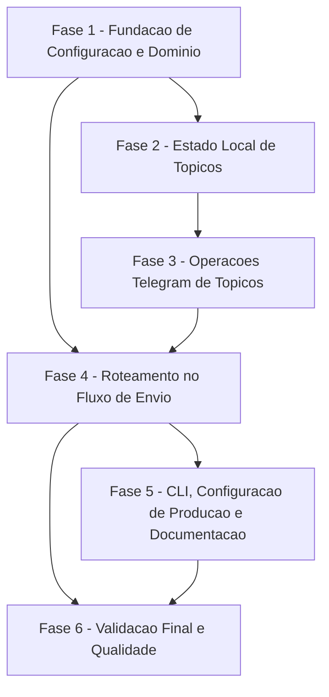

# Tarefas NotiCLI - Telegram Topics por Recipient

Escopo: implementar entrega Telegram por recipient em chat privado ou supergrupo com topicos, com criacao/reuso automatico de topicos por `--sender`, estado local separado, recuperacao controlada e documentacao operacional.

**Legenda de status:**
- `[ ]` Pendente
- `[~]` Em andamento
- `[x]` Concluido
- `[!]` Bloqueado

**Legenda de criticidade:**
- `[C]` Critico - Impacto financeiro direto, regulatorio, seguranca, SLA ou operacao bloqueante
- `[A]` Alto - Funcionalidade essencial
- `[M]` Medio - Necessario, mas sem urgencia imediata

---

## FASE 1 - Fundacao de Configuracao e Dominio

### 1.1 Estender Modelo de Recipient Telegram `[A]`

Ref: spec.md FR-001..FR-005; data-model.md Telegram Delivery Preference; contracts/telegram-topics.md Recipient Telegram Fields

- [x] 1.1.1 Adicionar campos de preferencia Telegram ao modelo de recipient.
- [x] 1.1.2 Preservar compatibilidade com `telegram_chat_id` como modo privado padrao.
- [x] 1.1.3 Validar `telegram_delivery_mode` aceitando apenas `private` e `topics`.
- [x] 1.1.4 Validar destino privado quando modo for `private`.
- [x] 1.1.5 Validar destino de supergrupo quando modo for `topics`.
- [x] 1.1.6 Cobrir validacoes do modelo com testes unitarios.

### 1.2 Estender Loader de Configuracao JSON `[A]`

Ref: contracts/telegram-topics.md Configuration Contract; plan.md Mapper layer config -> domain

- [x] 1.2.1 Mapear `telegram_delivery_mode` do JSON para o dominio.
- [x] 1.2.2 Mapear `telegram_topic_group_chat_id` e `telegram_topic_group_name`.
- [x] 1.2.3 Manter configuracoes existentes sem `telegram_delivery_mode` funcionando como `private`.
- [x] 1.2.4 Testar carga de recipient privado legado.
- [x] 1.2.5 Testar carga de recipient em modo `topics`.
- [x] 1.2.6 Testar erros de configuracao incompleta sem vazamento de token.

### 1.3 Definir Formatacao Telegram por Modo `[A]`

Ref: spec.md FR-003..FR-005; research.md Decision 8; quickstart.md Scenario 1

- [x] 1.3.1 Definir formatacao de texto para chat privado com titulo `[sender] title`.
- [x] 1.3.2 Definir formatacao de texto para topicos sem prefixo `[sender]`.
- [x] 1.3.3 Preservar corpo da mensagem em ambos os modos.
- [x] 1.3.4 Testar formatacao privada com sender e titulo.
- [x] 1.3.5 Testar formatacao em topico sem duplicar sender.

---

## FASE 2 - Estado Local de Topicos

### 2.1 Criar Modelo de Estado de Topicos `[A]`

Ref: spec.md FR-008..FR-009; data-model.md Topic State; contracts/telegram-topics.md Topic State Contract

- [x] 2.1.1 Definir estrutura de estado com `version`, `updated_at` e `associations`.
- [x] 2.1.2 Definir associacao por `recipient_id`, `chat_id` e `sender`.
- [x] 2.1.3 Incluir `topic_name`, `message_thread_id`, timestamps e status.
- [x] 2.1.4 Garantir que estado nao armazena token ou segredo.
- [x] 2.1.5 Testar serializacao e desserializacao do estado.
- [x] 2.1.6 Testar rejeicao de estado malformado.

### 2.2 Implementar Repositorio de Estado em Arquivo `[C]`

Ref: spec.md FR-018-INFRA-STATE, FR-020-INFRA-LOCK, FR-021-INFRA-BACKUP; research.md Decisions 3, 4, 7

- [x] 2.2.1 Criar abstracao para carregar e salvar estado local.
- [x] 2.2.2 Inicializar estado vazio quando arquivo estiver ausente e diretorio for gravavel.
- [x] 2.2.3 Falhar de forma segura quando estado estiver malformado.
- [x] 2.2.4 Serializar mutacoes com lock local.
- [x] 2.2.5 Isolar qualquer lock especifico de sistema operacional atras de uma abstracao/adaptador portavel.
- [x] 2.2.6 Preservar ultimo estado valido antes de substituir arquivo existente.
- [x] 2.2.7 Usar escrita atomica para reduzir risco de corrupcao.
- [x] 2.2.8 Testar ausencia, leitura, escrita, lock, adaptador portavel e backup.

### 2.3 Implementar Identidade e Nome de Topico `[A]`

Ref: spec.md FR-022..FR-024; research.md Decision 6; quickstart.md Scenario 8

- [x] 2.3.1 Usar `recipient_id + chat_id + sender` como chave de associacao.
- [x] 2.3.2 Sanitizar nome exibido do topico a partir do sender.
- [x] 2.3.3 Remover caracteres de controle e normalizar espacos.
- [x] 2.3.4 Respeitar restricoes de tamanho/nome do provedor.
- [x] 2.3.5 Disambiguar colisoes de nome exibido de forma deterministica.
- [x] 2.3.6 Testar sender simples, sender com espacos, controle e colisao.

---

## FASE 3 - Operacoes Telegram de Topicos

### 3.1 Estender Cliente Telegram para Forum Topics `[A]`

Ref: research.md Decision 1; contracts/telegram-topics.md Command Behavior; quickstart.md Scenario 2

- [x] 3.1.1 Adicionar operacao de criacao de forum topic no adaptador Telegram.
- [x] 3.1.2 Capturar `message_thread_id` retornado pelo provedor.
- [x] 3.1.3 Adicionar suporte a `message_thread_id` no envio de mensagem.
- [x] 3.1.4 Manter envio privado sem `message_thread_id`.
- [x] 3.1.5 Mapear falhas HTTP/provedor para `delivery_failure` sem token.
- [x] 3.1.6 Testar payload de criacao de topico com servidor HTTP fake.
- [x] 3.1.7 Testar payload de envio com `message_thread_id`.

### 3.2 Integrar Reuso de Topicos Conhecidos `[A]`

Ref: spec.md FR-006..FR-007; quickstart.md Scenario 3; checklist requirements.md CHK004

- [x] 3.2.1 Buscar associacao existente antes de criar topico.
- [x] 3.2.2 Enviar mensagem para `message_thread_id` conhecido.
- [x] 3.2.3 Atualizar `last_used_at` e `last_verified_at` apos sucesso.
- [x] 3.2.4 Evitar chamada de criacao em reuso de topico conhecido.
- [x] 3.2.5 Testar reuso com estado preexistente.
- [x] 3.2.6 Testar que o reuso respeita recipient e chat_id.

### 3.3 Implementar Criacao Automatica em Cache Miss `[A]`

Ref: spec.md FR-006, FR-019-INFRA-IDEMP; plan.md Architecture Decision; quickstart.md Scenario 2

- [x] 3.3.1 Detectar ausencia de associacao para recipient/chat/sender.
- [x] 3.3.2 Criar topico com nome sanitizado e disambiguado.
- [x] 3.3.3 Persistir associacao antes ou durante o fluxo de envio de forma consistente.
- [x] 3.3.4 Enviar a mensagem no topico recem-criado.
- [x] 3.3.5 Garantir idempotencia local sob lock.
- [x] 3.3.6 Testar criacao automatica em cache miss.
- [x] 3.3.7 Testar limite de no maximo uma criacao por envio feliz.

### 3.4 Implementar Recuperacao de Topico Stale `[A]`

Ref: spec.md FR-012, FR-025; plan.md Recovery Decision; quickstart.md Scenario 6

- [x] 3.4.1 Identificar falhas compativeis com topico conhecido inutilizavel.
- [x] 3.4.2 Marcar associacao antiga como `stale` ou `replaced`.
- [x] 3.4.3 Criar um unico topico substituto.
- [x] 3.4.4 Persistir associacao substituta.
- [x] 3.4.5 Repetir o envio uma unica vez.
- [x] 3.4.6 Retornar `delivery_failure` se substituicao ou retry falhar.
- [x] 3.4.7 Testar recuperacao bem-sucedida e falha apos retry.

---

## FASE 4 - Roteamento no Fluxo de Envio

### 4.1 Integrar Modo Privado no Sender Telegram `[A]`

Ref: spec.md User Story 2, FR-002..FR-003; quickstart.md Scenario 1

- [x] 4.1.1 Detectar modo privado por default ou configuracao explicita.
- [x] 4.1.2 Validar destino privado antes de enviar.
- [x] 4.1.3 Enviar mensagem privada mantendo comportamento legado.
- [x] 4.1.4 Aplicar titulo `[sender] title` em modo privado.
- [x] 4.1.5 Testar envio privado com configuracao legada.
- [x] 4.1.6 Testar erro de destino privado ausente.

### 4.2 Integrar Modo Topicos no Sender Telegram `[A]`

Ref: spec.md User Story 3, FR-004..FR-007; contracts/telegram-topics.md Behavior by Recipient Mode

- [x] 4.2.1 Detectar modo `topics` por recipient.
- [x] 4.2.2 Validar destino de supergrupo antes de operar topicos.
- [x] 4.2.3 Conectar sender Telegram ao repositorio de estado.
- [x] 4.2.4 Executar fluxo buscar/criar/reusar topico.
- [x] 4.2.5 Enviar mensagem sem prefixo `[sender]` no titulo.
- [x] 4.2.6 Testar fluxo completo com HTTP fake e estado temporario.

### 4.3 Preservar Contratos de Erro e Seguranca `[C]`

Ref: spec.md FR-010..FR-015; contracts/telegram-topics.md Failure Diagnostics; constitution.md Secure Configuration

- [x] 4.3.1 Mapear configuracao invalida de modo/destino para categoria adequada.
- [x] 4.3.2 Mapear falha de permissao do bot para `delivery_failure`.
- [x] 4.3.3 Mapear falha irrecuperavel de estado local para categoria apropriada.
- [x] 4.3.4 Garantir redacao de token em todas as falhas de topico.
- [x] 4.3.5 Manter anexos Telegram como `attachment_error`.
- [x] 4.3.6 Testar diagnosticos sem vazamento de token e sem prompts.

---

## FASE 5 - CLI, Configuracao de Producao e Documentacao

### 5.1 Atualizar Contratos e Exemplos Publicos `[M]`

Ref: spec.md FR-016..FR-017; contracts/telegram-topics.md; README.md

- [x] 5.1.1 Atualizar README com modo privado e modo topicos.
- [x] 5.1.2 Documentar campos `telegram_delivery_mode` e `telegram_topic_group_chat_id`.
- [x] 5.1.3 Documentar arquivo de estado separado e politica de backup.
- [x] 5.1.4 Documentar limitacao de descoberta/listagem de topicos.
- [x] 5.1.5 Documentar que bind/list/unbind sao trabalho futuro.
- [x] 5.1.6 Revisar exemplos para nao expor IDs sensiveis ou tokens.

### 5.2 Atualizar Quickstart Operacional Local `[M]`

Ref: quickstart.md Scenarios 1..9

- [x] 5.2.1 Documentar como obter chat privado.
- [x] 5.2.2 Documentar como preparar supergrupo com topicos e bot admin.
- [x] 5.2.3 Documentar smoke test de criacao de topico.
- [x] 5.2.4 Documentar smoke test de reuso de topico.
- [x] 5.2.5 Documentar restauracao/backup do estado local.
- [x] 5.2.6 Validar comandos documentados contra o binario local.

### 5.3 Preparar Configuracao de Producao Inicial `[M]`

Ref: plan.md State Decision; contracts/telegram-topics.md Topic State Contract

- [x] 5.3.1 Preparar arquivo irmao `/opt/NotiCLI/config/noticli.telegram-topics.json` com permissoes adequadas.
- [x] 5.3.2 Configurar recipient de teste para modo `topics` sem remover modo privado existente.
- [x] 5.3.3 Garantir que arquivo de estado nao seja legivel por usuarios comuns.
- [x] 5.3.4 Validar execucao via `noticli` por usuario sem acesso direto ao config/state.
- [x] 5.3.5 Registrar comandos de rollback para voltar ao binario de teste anterior.

---

## FASE 6 - Validacao Final e Qualidade

### 6.1 Cobrir Testes Integrados da CLI `[A]`

Ref: spec.md SC-001..SC-005; quickstart.md Scenarios 1..6

- [x] 6.1.1 Testar private mode via CLI com sender prefixado.
- [x] 6.1.2 Testar topics mode via CLI com criacao de topico.
- [x] 6.1.3 Testar topics mode via CLI com reuso de topico.
- [x] 6.1.4 Testar configuracao incompleta de topics mode.
- [x] 6.1.5 Testar recuperacao de topico stale.
- [x] 6.1.6 Validar exit codes esperados em todos os cenarios.

### 6.2 Cobrir Concorrencia e Estado `[C]`

Ref: spec.md FR-019-INFRA-IDEMP, FR-020-INFRA-LOCK, SC-007; quickstart.md Scenario 7

- [x] 6.2.1 Testar duas execucoes simultaneas para mesmo recipient/chat/sender.
- [x] 6.2.2 Verificar que estado final permanece valido.
- [x] 6.2.3 Verificar que ha no maximo uma associacao ativa por chave.
- [x] 6.2.4 Testar falha de lock ou escrita sem corromper estado existente.
- [x] 6.2.5 Testar backup do estado antes de substituicao.

### 6.3 Validar Performance e Chamadas ao Provedor `[M]`

Ref: spec.md SC-009..SC-011; plan.md Performance Goals

- [x] 6.3.1 Validar que private mode faz uma chamada de envio. <!-- TestSendPostsMessageToTelegramAPI; TestSendExplicitPrivateModeDoesNotRequireTopicStore -->
- [x] 6.3.2 Validar que reuso de topico nao chama criacao de topico. <!-- TestSendOmitsSenderPrefixForTopicMode; TestSendTopicModeFullFlowUsesTemporaryStateRepository -->
- [x] 6.3.3 Validar que cache miss faz no maximo uma criacao e um envio. <!-- TestSendTopicModeCreatesTopicOnCacheMissAndSendsToCreatedThread -->
- [x] 6.3.4 Validar que stale recovery faz no maximo uma criacao substituta e um retry. <!-- TestSendTopicModeRecoversStaleKnownTopicWithOneReplacement -->
- [x] 6.3.5 Registrar resultados nos comentarios das tarefas ao concluir.

### 6.4 Executar Validacao de Build e Regressao `[A]`

Ref: plan.md Technical Context; constitution.md Delivery Standards

- [x] 6.4.1 Executar `go test ./...`.
- [x] 6.4.2 Executar `go build ./...`.
- [x] 6.4.3 Gerar build local de teste do binario.
- [x] 6.4.4 Executar smoke test Telegram privado em producao inicial.
- [x] 6.4.5 Executar smoke test Telegram topics em producao inicial.
- [x] 6.4.6 Confirmar que email e Slack nao sofreram regressao de contrato.

---

## Matriz de Dependencias

## Resumo Quantitativo

| Fase | Tarefas | Subtarefas | Criticidade |
|------|---------|------------|-------------|
| 1 - Fundacao de Configuracao e Dominio | 3 | 17 | A |
| 2 - Estado Local de Topicos | 3 | 19 | C/A |
| 3 - Operacoes Telegram de Topicos | 4 | 27 | A |
| 4 - Roteamento no Fluxo de Envio | 3 | 18 | C/A |
| 5 - CLI, Configuracao de Producao e Documentacao | 3 | 17 | M |
| 6 - Validacao Final e Qualidade | 4 | 22 | C/A/M |
| **Total** | **20** | **120** | - |

## Escopo Coberto

| Item | Descricao | Fase |
|------|-----------|------|
| Private mode | Entrega Telegram privada com prefixo `[sender] title` | 1, 4, 6 |
| Topics mode | Entrega em supergrupo com topicos por sender | 1, 3, 4, 6 |
| Estado local | Arquivo separado de associacoes sender-topic | 2, 5, 6 |
| Idempotencia | Lock local e chave recipient/chat/sender | 2, 3, 6 |
| Recuperacao | Substituicao controlada de topico stale | 3, 4, 6 |
| Seguranca | Redacao de token e permissoes de config/state | 4, 5, 6 |
| Documentacao | README, contratos e quickstart operacional | 5 |

## Escopo Excluido

| Item | Descricao | Motivo |
|------|-----------|--------|
| Bot commands | `/noticli_bind`, `/noticli_unbind`, `/noticli_topics` | Pos-MVP conforme spec e research |
| Webhook/polling | Listener para comandos administrativos do bot | Requer runtime adicional fora do MVP da feature |
| Criacao de grupos | Criar supergrupo ou adicionar usuarios automaticamente | Telegram Bot API nao oferece esse fluxo para bots |
| Descoberta completa de topicos | Listar todos os topicos existentes por API | Bot API nao fornece inventario completo |
| Anexos Telegram | Enviar arquivos pelo Telegram | Mantido fora do escopo; comportamento atual e `attachment_error` |
